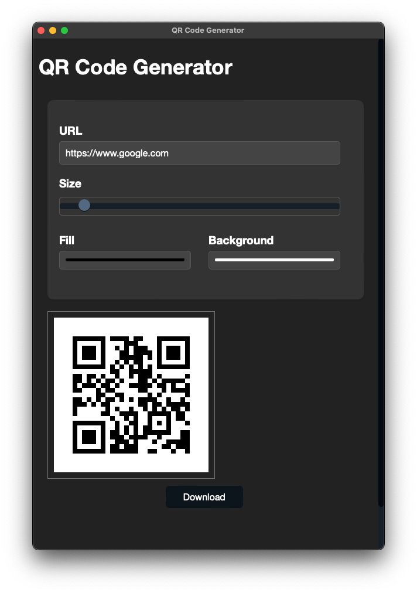

# QR Code Generator

This is a QR-generator service you can host on your own machine.

## Table of Contents

* [Screenshots](#screenshots)
* [API](#api)
* [Installation](#installation)
* [Authors](#authors)

## Screenshots



## API

Example: `http://localhost:5000?url=https://mbarde.de&boxsize=50`

Expected parameters:

* `url`: URL to "qr-encode"
* `size` (optional): Size (width & height) of resulting QR code image
* `boxsize` (optional): Size of single box of the QR code (when `size` is set as well, this is the size of each box *before* image gets resized)
* `fill` (optional): Hex code for fill color (without `#`)
* `back` (optional): Hex code for background color (without `#`)

## Installation

```bash
git clone https://github.com/mantreshkhurana/qr-code-geneartor-flask.git
cd qr-code-geneartor-flask
pip install -r requirements.txt
python app.py
```

## Authors

* [Mantresh Kumar | RA2311003011417](https://github.com/mantreshkhurana)
* Arpit Mohan Saxena | RA2311003011378
